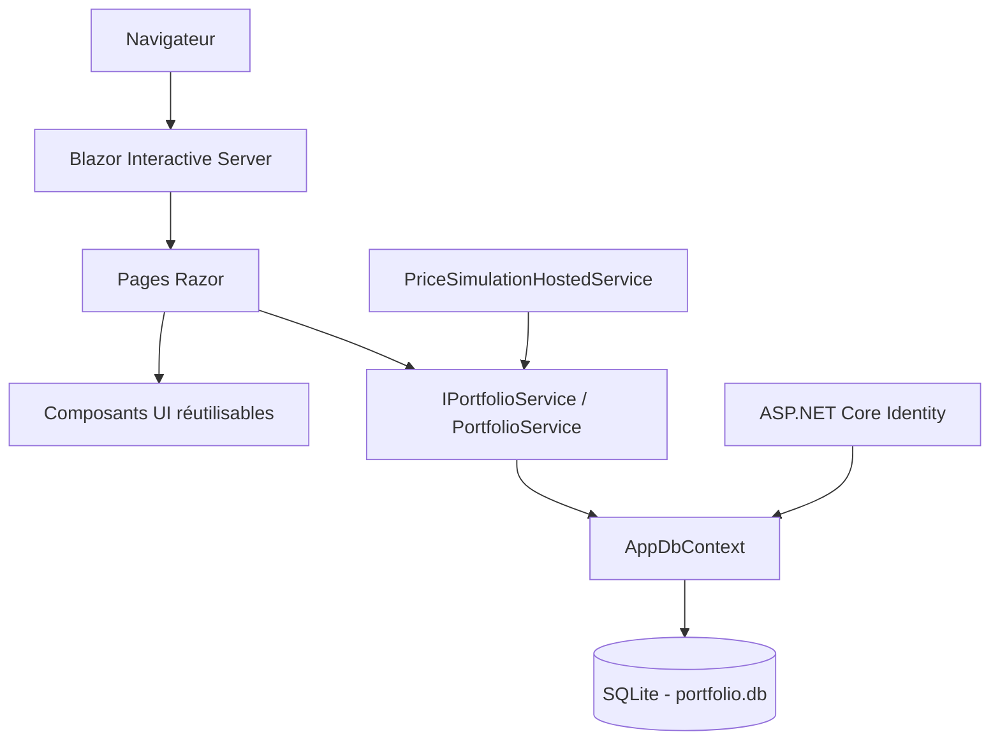
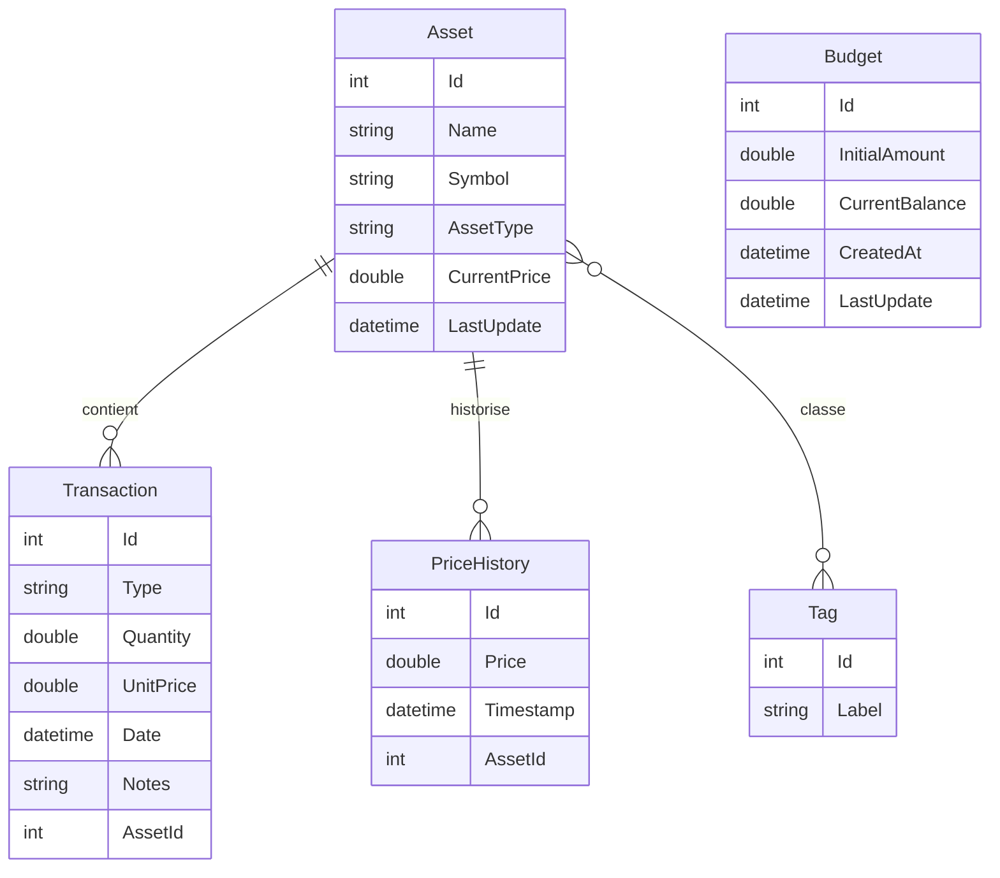

<div align="center">

# InvestPortfolio

**Application web .NET de gestion de portefeuille d'investissement avec authentification, budget, transactions, simulation de marché et tableaux de bord analytiques.**


</div>

---

## Table des matières

- [Présentation](#présentation)
- [Fonctionnalités principales](#fonctionnalités-principales)
- [Parcours utilisateur](#parcours-utilisateur)
- [Pages et routes](#pages-et-routes)
- [Stack technique](#stack-technique)
- [Architecture](#architecture)
- [Structure du projet](#structure-du-projet)
- [Modèle de données](#modèle-de-données)
- [Règles métier](#règles-métier)
- [Authentification et rôles](#authentification-et-rôles)
- [Simulation des prix](#simulation-des-prix)
- [Tableaux de bord et statistiques](#tableaux-de-bord-et-statistiques)
- [Installation et lancement](#installation-et-lancement)
- [Configuration](#configuration)
- [Commandes utiles](#commandes-utiles)
- [Notes importantes](#notes-importantes)

---

## Présentation

InvestPortfolio est une application de suivi d'investissements développée avec **ASP.NET Core Blazor Interactive Server**. Elle permet de gérer un portefeuille composé d'actions, de cryptomonnaies et d'ETF, tout en suivant le budget disponible, les achats, les ventes, les performances et l'évolution des prix.

L'application combine une interface moderne de type tableau de bord financier avec une couche métier claire, une persistance SQLite via Entity Framework Core, une authentification ASP.NET Core Identity et des graphiques Radzen.

Le style visuel est inspiré des plateformes de trading modernes : thème sombre, cartes analytiques, accents dorés, indicateurs verts/rouges pour les gains et pertes, tableaux responsives et pages d'authentification dédiées.

Une documentation technique complète existe aussi dans [`DOCUMENTATION.md`](DOCUMENTATION.md).

---

## Fonctionnalités principales

### Gestion des actifs

- Création d'actifs financiers par l'administrateur.
- Modification d'actifs existants par l'administrateur.
- Suppression d'actifs par l'administrateur.
- Consultation de tous les actifs par les utilisateurs connectés.
- Types d'actifs disponibles : `Action`, `Crypto`, `ETF`.
- Recherche par nom ou par symbole.
- Filtrage par type d'actif.
- Affichage en tableau ou en cartes.
- Page de détail pour chaque actif.
- Historisation du prix initial lors de la création.
- Historisation du prix lors des mises à jour.

### Gestion des transactions

- Création de transactions d'achat avec le type `Achat`.
- Création de transactions de vente avec le type `Vente`.
- Calcul automatique du montant total.
- Utilisation automatique du prix courant de l'actif sélectionné.
- Validation du budget avant un achat.
- Validation de la quantité possédée avant une vente.
- Historique complet des transactions.
- Recherche par nom ou symbole d'actif.
- Filtrage par type de transaction.
- Suppression d'une transaction avec ajustement automatique du budget.

### Gestion du budget

- Budget initial stocké en base de données.
- Solde disponible mis à jour automatiquement.
- Ajout de fonds depuis la page budget.
- Déduction automatique du solde lors d'un achat.
- Augmentation automatique du solde lors d'une vente.
- Restauration du solde lors de la suppression d'une transaction.

### Dashboard

- Valeur totale du portefeuille.
- Gain ou perte globale.
- Budget disponible.
- Nombre total d'actifs.
- Répartition du portefeuille par type d'actif.
- Performance par actif.
- Flux mensuel des achats et ventes.
- Jauge de rendement global.
- Dernières transactions.
- Rafraîchissement automatique toutes les 30 secondes.

### Analyse avancée

- Tableau détaillé des performances par actif.
- Gain/perte en montant.
- Gain/perte en pourcentage.
- Barres visuelles de performance.
- Graphique de répartition par type.
- Graphique du nombre d'actifs par type.
- Graphique d'évolution mensuelle des achats et ventes.
- Total investi.
- Total vendu.
- Nombre total de transactions.

### Simulation de marché

- Simulation automatique des prix toutes les minutes.
- Simulation manuelle du marché par l'administrateur.
- Volatilité différente selon le type d'actif.
- Enregistrement de chaque nouveau prix dans l'historique.
- Graphique d'évolution du prix sur la page détail d'un actif.

### Authentification

- Connexion par email et mot de passe.
- Inscription utilisateur.
- Déconnexion.
- Compte administrateur créé automatiquement au démarrage.
- Affichage conditionnel des actions administrateur.
- Pages avec attributs d'autorisation Blazor.

---

## Parcours utilisateur

1. L'utilisateur ouvre l'application sur `http://localhost:5202`.
2. Il se connecte avec le compte administrateur ou crée un compte.
3. Il ajoute des fonds depuis la page `/budget`.
4. L'administrateur crée des actifs depuis `/assets` ou `/edit-asset`.
5. L'utilisateur crée des achats ou ventes depuis `/new-transaction`.
6. Le dashboard affiche la valeur du portefeuille, les performances et les dernières transactions.
7. La page `/analytics` donne une vue détaillée des statistiques.
8. La page détail d'un actif affiche la position, le prix moyen, l'historique des prix et les transactions associées.

---

## Pages et routes

| Route | Page | Accès | Description |
| --- | --- | --- | --- |
| `/` | Dashboard | Utilisateur connecté | Vue principale du portefeuille. |
| `/dashboard` | Dashboard | Utilisateur connecté | Même page que `/`. |
| `/assets` | Actifs | Utilisateur connecté | Catalogue des actifs, recherche, filtres, vue cartes/tableau. |
| `/asset-details/{id}` | Détail actif | Utilisateur connecté | Prix, quantité détenue, valeur de position, historique et transactions. |
| `/edit-asset` | Nouvel actif | Admin | Formulaire de création d'actif. |
| `/edit-asset/{id}` | Modifier actif | Admin | Formulaire de modification d'actif. |
| `/new-transaction` | Nouvelle transaction | Utilisateur connecté | Achat ou vente d'un actif. |
| `/transactions` | Transactions | Utilisateur connecté | Historique filtrable des transactions. |
| `/analytics` | Analytique | Utilisateur connecté | Analyse détaillée des performances. |
| `/budget` | Budget | Utilisateur connecté | Consultation du budget et ajout de fonds. |
| `/login` | Connexion | Public | Formulaire de connexion. |
| `/register` | Inscription | Public | Formulaire de création de compte. |
| `/Error` | Erreur | Public | Page d'erreur générique. |
| `/not-found` | Introuvable | Public | Page introuvable simple. |

---

## Stack technique

| Couche | Technologie |
| --- | --- |
| Framework | ASP.NET Core avec Blazor Interactive Server |
| Runtime ciblé | `.NET 10.0` |
| Interface | Razor Components, Bootstrap, Bootstrap Icons |
| Graphiques | Radzen Blazor |
| ORM | Entity Framework Core |
| Base de données | SQLite |
| Authentification | ASP.NET Core Identity |
| Services métier | Injection de dépendances avec `IPortfolioService` |
| Tâches de fond | `BackgroundService` |
| Style | CSS personnalisé dans `wwwroot/app.css` |

Packages utilisés par le projet :

```xml
<PackageReference Include="Microsoft.AspNetCore.Identity.EntityFrameworkCore" Version="10.0.7" />
<PackageReference Include="Microsoft.EntityFrameworkCore.Design" Version="10.0.3" />
<PackageReference Include="Microsoft.EntityFrameworkCore.Sqlite" Version="10.0.3" />
<PackageReference Include="Radzen.Blazor" Version="10.4.1" />
```

---

## Architecture

Le projet est organisé en couches simples : interface, services métier, accès aux données et modèles.



### Flux principal

1. Les pages Razor reçoivent les actions de l'utilisateur.
2. Les pages appellent `IPortfolioService`.
3. `PortfolioService` applique les règles métier.
4. `PortfolioService` lit et écrit les données via `AppDbContext`.
5. `AppDbContext` persiste les données dans SQLite.
6. ASP.NET Core Identity utilise le même contexte pour les utilisateurs et rôles.
7. Le service de fond met à jour les prix à intervalle régulier.

---

## Structure du projet

```text
InvestPortfolio/
├── Components/
│   ├── App.razor
│   ├── Routes.razor
│   ├── _Imports.razor
│   ├── Layout/
│   │   ├── MainLayout.razor
│   │   ├── EmptyLayout.razor
│   │   ├── NavMenu.razor
│   │   └── ReconnectModal.razor
│   ├── Pages/
│   │   ├── Dashboard.razor
│   │   ├── Assets.razor
│   │   ├── AssetDetails.razor
│   │   ├── EditAsset.razor
│   │   ├── NewTransaction.razor
│   │   ├── Transactions.razor
│   │   ├── Analytics.razor
│   │   ├── BudgetSetup.razor
│   │   ├── Login.razor
│   │   ├── Register.razor
│   │   ├── Error.razor
│   │   └── NotFound.razor
│   └── UI/
│       ├── AssetCard.razor
│       ├── AssetTable.razor
│       ├── KpiCard.razor
│       └── TransactionTable.razor
├── Data/
│   └── AppDbContext.cs
├── Migrations/
│   ├── 20260512164605_InitialCreate.cs
│   ├── 20260512164605_InitialCreate.Designer.cs
│   └── AppDbContextModelSnapshot.cs
├── Models/
│   ├── Asset.cs
│   ├── Transaction.cs
│   ├── PriceHistory.cs
│   ├── Tag.cs
│   ├── Budget.cs
│   └── PortfolioStats.cs
├── Services/
│   ├── IPortfolioService.cs
│   ├── PortfolioService.cs
│   └── PriceSimulationHostedService.cs
├── Properties/
│   └── launchSettings.json
├── wwwroot/
│   ├── app.css
│   ├── favicon.png
│   └── lib/bootstrap/
├── appsettings.json
├── appsettings.Development.json
├── DOCUMENTATION.md
├── InvestPortfolio.csproj
└── README.md
```

---

## Modèle de données



### `Asset`

Représente un actif financier disponible dans le portefeuille.

| Propriété | Description |
| --- | --- |
| `Id` | Identifiant unique. |
| `Name` | Nom de l'actif, obligatoire, entre 2 et 100 caractères. |
| `Symbol` | Symbole ou ticker, obligatoire, entre 1 et 10 caractères. |
| `AssetType` | Type de l'actif : `Action`, `Crypto`, `ETF`. |
| `CurrentPrice` | Prix courant utilisé pour les transactions. |
| `LastUpdate` | Date de dernière mise à jour du prix. |
| `Transactions` | Transactions liées à cet actif. |
| `PriceHistories` | Historique des prix de cet actif. |
| `Tags` | Tags associés à l'actif. |

### `Transaction`

Représente une opération d'achat ou de vente.

| Propriété | Description |
| --- | --- |
| `Id` | Identifiant unique. |
| `Type` | `Achat` ou `Vente`. |
| `Quantity` | Quantité achetée ou vendue. |
| `UnitPrice` | Prix unitaire au moment de la transaction. |
| `TotalAmount` | Propriété calculée : `Quantity * UnitPrice`. |
| `Date` | Date de création de la transaction. |
| `Notes` | Notes optionnelles. |
| `AssetId` | Clé étrangère vers l'actif. |
| `Asset` | Propriété de navigation vers l'actif. |

### `PriceHistory`

Représente une valeur historique du prix d'un actif.

| Propriété | Description |
| --- | --- |
| `Id` | Identifiant unique. |
| `Price` | Prix enregistré. |
| `Timestamp` | Date et heure de l'enregistrement. |
| `AssetId` | Clé étrangère vers l'actif. |
| `Asset` | Propriété de navigation vers l'actif. |

### `Budget`

Représente le capital disponible pour investir.

| Propriété | Description |
| --- | --- |
| `Id` | Identifiant unique. |
| `InitialAmount` | Montant total ajouté au portefeuille. |
| `CurrentBalance` | Solde actuellement disponible. |
| `CreatedAt` | Date de création. |
| `LastUpdate` | Date de dernière mise à jour. |

### `Tag`

Représente une étiquette de classification. Le modèle supporte une relation plusieurs-à-plusieurs entre actifs et tags.

### DTO statistiques

`PortfolioStats.cs` contient les objets utilisés par les graphiques :

- `AssetAllocationStat` pour la répartition par type d'actif.
- `AssetPerformanceStat` pour la performance par actif.
- `MonthlyTransactionStat` pour les achats et ventes par mois.

---

## Règles métier

### Actifs

- Le nom de l'actif est obligatoire.
- Le symbole est obligatoire.
- Le type d'actif est obligatoire.
- La création d'un actif ajoute une première entrée dans l'historique des prix.
- La modification d'un actif ajoute une nouvelle entrée dans l'historique des prix.
- Les actions de création, modification et suppression sont réservées au rôle `Admin`.

### Transactions

- Une transaction doit être associée à un actif existant.
- La quantité doit être supérieure à `0`.
- Le prix unitaire utilisé est le prix courant de l'actif au moment de la transaction.
- Un achat est refusé si le budget disponible est insuffisant.
- Une vente est refusée si la quantité vendue dépasse la quantité détenue.
- La quantité détenue est calculée avec `quantité achetée - quantité vendue`.
- La suppression d'une transaction annule son effet sur le budget.

### Budget

- Une ligne de budget est créée automatiquement au démarrage si aucune n'existe.
- Ajouter des fonds augmente `InitialAmount` et `CurrentBalance`.
- Un achat diminue `CurrentBalance`.
- Une vente augmente `CurrentBalance`.

### Valeur du portefeuille

La valeur du portefeuille est calculée ainsi :

```text
somme((quantité achetée - quantité vendue) * prix courant de l'actif)
```

Les positions négatives ou nulles ne sont pas ajoutées à la valeur totale.

### Gain ou perte

Le gain ou la perte par actif est calculé ainsi :

```text
(valeur courante + montant total vendu) - montant total investi
```

Le gain ou la perte globale correspond à la somme des résultats de tous les actifs.

---

## Authentification et rôles

L'application utilise ASP.NET Core Identity avec des formulaires de connexion, d'inscription et de déconnexion.

### Compte administrateur seedé

Au démarrage, l'application crée le rôle `Admin` et un compte administrateur si celui-ci n'existe pas déjà.

| Email | Mot de passe | Rôle |
| --- | --- | --- |
| `admin@invest.com` | `Admin123!` | `Admin` |

### Accès par rôle

| Action | Utilisateur connecté | Admin |
| --- | --- | --- |
| Consulter le dashboard | Oui | Oui |
| Consulter les actifs | Oui | Oui |
| Consulter le détail d'un actif | Oui | Oui |
| Créer une transaction | Oui | Oui |
| Consulter l'analytique | Oui | Oui |
| Gérer le budget | Oui | Oui |
| Créer un actif | Non | Oui |
| Modifier un actif | Non | Oui |
| Supprimer un actif | Non | Oui |
| Simuler le marché manuellement | Non | Oui |

### Endpoints d'authentification

| Méthode | Endpoint | Description |
| --- | --- | --- |
| `POST` | `/api/auth/login` | Connecte l'utilisateur puis redirige vers `/dashboard`. |
| `POST` | `/api/auth/register` | Crée un utilisateur, le connecte puis redirige vers `/dashboard`. |
| `POST` | `/api/auth/logout` | Déconnecte l'utilisateur puis redirige vers `/login`. |

---

## Simulation des prix

Le projet contient un service de fond nommé `PriceSimulationHostedService`. Il simule l'évolution des prix des actifs toutes les minutes.

La formule utilisée est :

```text
nouveau prix = ancien prix * (1 + variation)
```

Le prix final est arrondi à deux décimales et ne peut pas descendre sous `0.01`.

### Volatilité par type d'actif

| Type | Variation maximale |
| --- | --- |
| `Crypto` | +/- 8% |
| `Action` | +/- 4% |
| `ETF` | +/- 2% |
| Autre | +/- 3% |

### Fonctionnement

- Le service démarre avec l'application.
- Il crée un scope de dépendances à chaque exécution.
- Il récupère `IPortfolioService`.
- Il appelle `SimulateAllPricesAsync()`.
- Chaque variation crée une entrée dans `PriceHistories`.
- Les pages dashboard et actifs se rafraîchissent automatiquement toutes les 30 secondes.

---

## Tableaux de bord et statistiques

### KPIs du dashboard

| KPI | Méthode utilisée |
| --- | --- |
| Valeur du portefeuille | `GetPortfolioValueAsync()` |
| Gain/perte global | `GetTotalGainLossAsync()` |
| Budget disponible | `GetBudgetBalanceAsync()` |
| Nombre d'actifs | `GetTotalAssetsCountAsync()` |

### Graphiques

| Graphique | Composant | Source des données |
| --- | --- | --- |
| Répartition par type | Radzen Donut / Pie | `GetAllocationByTypeAsync()` |
| Performance par actif | Radzen Column | `GetPerformanceByAssetAsync()` |
| Flux mensuel | Radzen Column / Line | `GetMonthlyTransactionsAsync()` |
| Rendement global | Radzen Radial Gauge | Gain/perte divisé par budget initial |
| Historique du prix | Radzen Line | `GetPriceHistoryAsync(assetId)` |

---

## Installation et lancement

### Prérequis

- Git.
- Un SDK .NET compatible avec `net10.0`.
- Aucun serveur de base de données externe n'est nécessaire, car SQLite est utilisé localement.

Vérifier les SDK installés :

```bash
dotnet --list-sdks
```

### Cloner le dépôt

```bash
git clone https://github.com/Kirazul/dotnet_project.git
cd dotnet_project
```

### Restaurer les dépendances

```bash
dotnet restore
```

### Lancer l'application

```bash
dotnet run
```

Le profil de lancement HTTP utilise :

```text
http://localhost:5202
```

### Connexion initiale

```text
Email:        admin@invest.com
Mot de passe: Admin123!
```

---

## Configuration

### Chaîne de connexion SQLite

La base de données est configurée dans `appsettings.json` :

```json
{
  "ConnectionStrings": {
    "DefaultConnection": "Data Source=portfolio.db"
  }
}
```

### Création de la base

Au démarrage, `Program.cs` exécute :

```csharp
context.Database.EnsureCreated();
```

Cette instruction crée le fichier `portfolio.db` si la base n'existe pas encore.

### Fichiers ignorés

Le fichier `.gitignore` exclut les éléments locaux suivants :

- `bin/`
- `obj/`
- `.vs/`
- fichiers SQLite locaux : `*.db`, `*.db-shm`, `*.db-wal`
- fichiers d'environnement locaux : `.env`, `.env.*`
- fichiers système comme `Thumbs.db` et `.DS_Store`

---

## Commandes utiles

### Build

```bash
dotnet build
```

### Lancement avec le profil HTTP

```bash
dotnet run --launch-profile http
```

### Ajouter une migration EF Core

```bash
dotnet ef migrations add NomDeMigration
```

### Appliquer les migrations

```bash
dotnet ef database update
```

### Installer l'outil EF Core CLI si nécessaire

```bash
dotnet tool install --global dotnet-ef
```

### Nettoyer les sorties de build

```bash
dotnet clean
```

---

## Notes importantes

- Le projet cible `net10.0`, il faut donc un SDK .NET compatible avec cette cible.
- Le fichier SQLite `portfolio.db` contient les données locales de l'application et n'est pas versionné.
- Le compte administrateur seedé est présent dans le code pour faciliter l'exécution locale et la démonstration.
- Le mot de passe administrateur par défaut doit être modifié si l'application est utilisée hors démonstration.
- Les règles de mot de passe Identity sont volontairement simplifiées dans `Program.cs`.
- Les données de portefeuille, budget et transactions sont actuellement stockées dans une base commune.
- Les modèles, services, pages et composants correspondent à l'état actuel du projet.

---

## Dépôt

GitHub : [https://github.com/Kirazul/dotnet_project](https://github.com/Kirazul/dotnet_project)
